# Commercial EV Fleet Management Platform - Complete Application Flow Chart

## Table of Contents
1. [High-Level Architecture Overview](#high-level-architecture-overview)
2. [System Architecture Diagram](#system-architecture-diagram)
3. [User Authentication Flow](#user-authentication-flow)
4. [Frontend Application Flow](#frontend-application-flow)
5. [Backend Microservices Architecture](#backend-microservices-architecture)
6. [Data Flow Diagrams](#data-flow-diagrams)
7. [Event-Driven Communication](#event-driven-communication)
8. [Database Architecture](#database-architecture)
9. [API Request Flow](#api-request-flow)
10. [Component Interaction Maps](#component-interaction-maps)

---

## High-Level Architecture Overview

```mermaid
flowchart TB
    subgraph "Client Layer"
        WEB[🌐 Web Browser]
        MOBILE[📱 Mobile App]
    end

    subgraph "Frontend - React Application :3000"
        REACT[React 18+<br/>Material-UI]
        REDUX[Redux Toolkit<br/>State Management]
        FIREBASE_SDK[Firebase SDK<br/>Authentication]
    end

    subgraph "API Layer"
        GATEWAY[🚪 API Gateway<br/>:8080]
        EUREKA[📡 Eureka Server<br/>Service Discovery<br/>:8761]
    end

    subgraph "Business Services Layer"
        AUTH[🔐 Auth Service<br/>:8081]
        FLEET[🚗 Fleet Service<br/>:8082]
        CHARGING[âš¡ Charging Service<br/>:8083]
        MAINT[🔧 Maintenance Service<br/>:8084]
        DRIVER[👤 Driver Service<br/>:8085]
        ANALYTICS[📊 Analytics Service<br/>:8086]
        NOTIFY[🔔 Notification Service<br/>:8087]
        BILLING[💰 Billing Service<br/>:8088]
    end

    subgraph "Data Layer"
        POSTGRES[(PostgreSQL<br/>:5432)]
        REDIS[(Redis Cache<br/>:6379)]
        
    end

    subgraph "External Services"
        FIREBASE_CLOUD[☁️ Firebase Auth]
        MAPS[🗺️ Maps API]
    end

    WEB --> REACT
    MOBILE --> REACT
    REACT --> REDUX
    REACT --> FIREBASE_SDK
    FIREBASE_SDK --> FIREBASE_CLOUD
    
    REACT --> GATEWAY
    GATEWAY --> EUREKA
    
    GATEWAY --> AUTH
    GATEWAY --> FLEET
    GATEWAY --> CHARGING
    GATEWAY --> MAINT
    GATEWAY --> DRIVER
    GATEWAY --> ANALYTICS
    GATEWAY --> NOTIFY
    GATEWAY --> BILLING
    
    AUTH --> POSTGRES
    FLEET --> POSTGRES
    CHARGING --> POSTGRES
    MAINT --> POSTGRES
    DRIVER --> POSTGRES
    ANALYTICS --> POSTGRES
    NOTIFY --> POSTGRES
    BILLING --> POSTGRES
    
    AUTH --> REDIS
    FLEET --> REDIS
    GATEWAY --> REDIS
    






    
    REACT --> MAPS
```

---

## System Architecture Diagram

```mermaid
flowchart LR
    subgraph "Infrastructure Services"
        direction TB
        ES[Eureka Server<br/>Service Registry<br/>:8761]
        GW[API Gateway<br/>Load Balancing<br/>Rate Limiting<br/>:8080]
    end

    subgraph "Core Business Modules"
        direction TB
        AS[Auth Service<br/>• User Management<br/>• Firebase Integration<br/>• Role-Based Access<br/>:8081]
        FS[Fleet Service<br/>• Vehicle Management<br/>• Fleet Operations<br/>• Events & State<br/>:8082]
        CS[Charging Service<br/>• Station Management<br/>• Session Tracking<br/>• Network Integration<br/>:8083]
    end

    subgraph "Supporting Modules"
        direction TB
        MS[Maintenance Service<br/>• Scheduling<br/>• Predictive Analytics<br/>• Work Orders<br/>:8084]
        DS[Driver Service<br/>• Driver Management<br/>• Performance<br/>• Assignments<br/>:8085]
        ANS[Analytics Service<br/>• Reporting<br/>• Business Intelligence<br/>• TCO Analysis<br/>:8086]
    end

    subgraph "Communication Modules"
        direction TB
        NS[Notification Service<br/>• Alerts<br/>• Email/SMS/Push<br/>• Templates<br/>:8087]
        BS[Billing Service<br/>• Invoicing<br/>• Cost Tracking<br/>• Payments<br/>:8088]
    end

    ES <--> GW
    GW --> AS
    GW --> FS
    GW --> CS
    GW --> MS
    GW --> DS
    GW --> ANS
    GW --> NS
    GW --> BS
```

---

## User Authentication Flow

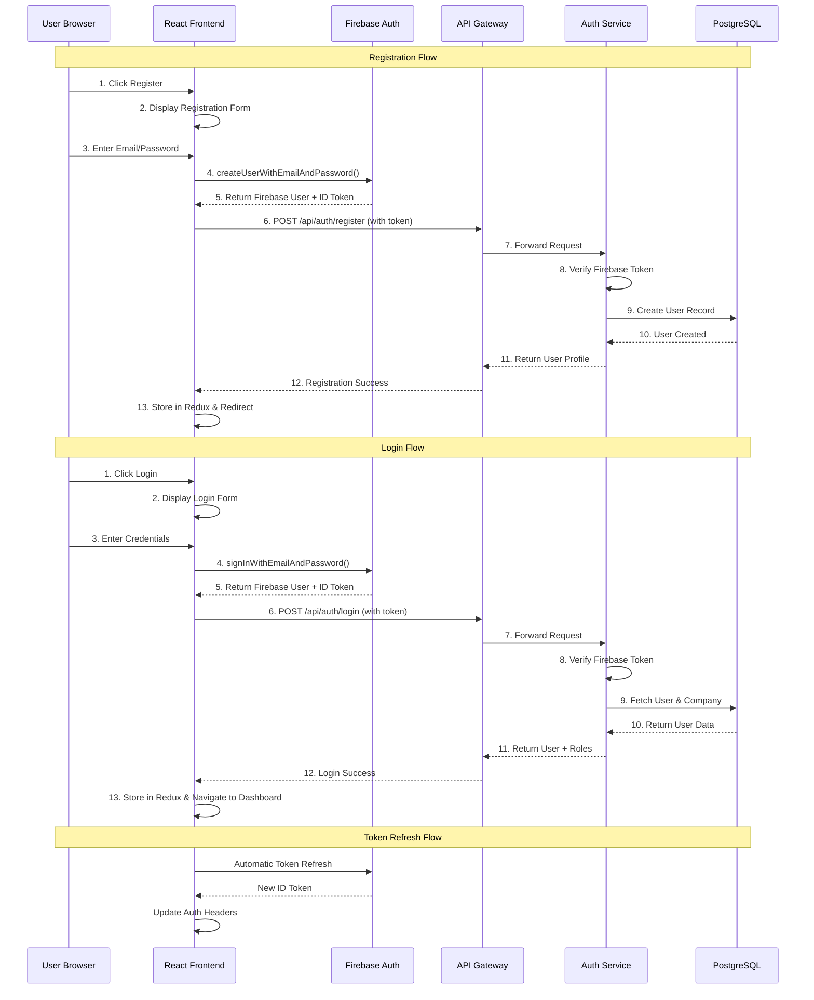

---

## Frontend Application Flow

```mermaid
flowchart TB
    subgraph "Entry Point"
        INDEX[index.tsx]
        APP[App.tsx]
    end

    subgraph "Authentication Layer"
        AUTH_HOOK[useAuth Hook]
        PROTECTED[ProtectedRoute]
        PUBLIC[PublicRoute]
    end

    subgraph "Navigation"
        HEADER[Header Component]
        SIDEBAR[Sidebar Component]
        ROUTES[AppRoutes]
    end

    subgraph "Public Pages"
        LOGIN[LoginPage]
        REGISTER[Register]
        FORGOT[ForgotPassword]
    end

    subgraph "Protected Pages"
        DASH[DashboardPage]
        FLEET_P[FleetManagementPage]
        CHARGING_P[ChargingPage]
        STATIONS[StationDiscoveryPage]
        DRIVERS_P[DriversPage]
        MAINT_P[MaintenancePage]
        ANALYTICS_P[AnalyticsPage]
        BILLING_P[BillingPage]
        PROFILE[ProfilePage]
        SETTINGS[SettingsPage]
        REPORTS[VehicleReportPage]
        DOCS[DocumentManagementPage]
        EXPENSES[ExpenseManagementPage]
        ROUTES_P[RouteOptimizationPage]
        CUSTOMERS[CustomerManagementPage]
        GEO[GeofenceManagementPage]
    end

    subgraph "State Management - Redux"
        STORE[Redux Store]
        AUTH_SLICE[authSlice]
        FLEET_SLICE[vehicleSlice]
        CHARGE_SLICE[chargingSlice]
        OTHER_SLICES[Other Slices...]
    end

    subgraph "API Services"
        API[api.ts - Axios Instance]
        AUTH_SVC[authService]
        VEHICLE_SVC[vehicleService]
        CHARGE_SVC[chargingService]
        DRIVER_SVC[driverService]
        MAINT_SVC[maintenanceService]
        ANALYTICS_SVC[analyticsService]
        BILLING_SVC[billingService]
        NOTIF_SVC[notificationService]
    end

    INDEX --> APP
    APP --> AUTH_HOOK
    AUTH_HOOK --> PROTECTED
    AUTH_HOOK --> PUBLIC
    
    APP --> HEADER
    APP --> SIDEBAR
    APP --> ROUTES
    
    PUBLIC --> LOGIN
    PUBLIC --> REGISTER
    PUBLIC --> FORGOT
    
    PROTECTED --> DASH
    PROTECTED --> FLEET_P
    PROTECTED --> CHARGING_P
    PROTECTED --> STATIONS
    PROTECTED --> DRIVERS_P
    PROTECTED --> MAINT_P
    PROTECTED --> ANALYTICS_P
    PROTECTED --> BILLING_P
    PROTECTED --> PROFILE
    PROTECTED --> SETTINGS
    PROTECTED --> REPORTS
    PROTECTED --> DOCS
    PROTECTED --> EXPENSES
    PROTECTED --> ROUTES_P
    PROTECTED --> CUSTOMERS
    PROTECTED --> GEO

    DASH --> STORE
    FLEET_P --> STORE
    CHARGING_P --> STORE
    
    STORE --> AUTH_SLICE
    STORE --> FLEET_SLICE
    STORE --> CHARGE_SLICE
    STORE --> OTHER_SLICES
    
    AUTH_SLICE --> API
    FLEET_SLICE --> API
    
    API --> AUTH_SVC
    API --> VEHICLE_SVC
    API --> CHARGE_SVC
    API --> DRIVER_SVC
    API --> MAINT_SVC
    API --> ANALYTICS_SVC
    API --> BILLING_SVC
    API --> NOTIF_SVC
```

---

## Backend Microservices Architecture

### Monolith Backend Structure

```mermaid
flowchart TB
    subgraph "evfleet-monolith"
        MAIN[EvFleetApplication.java<br/>Main Entry Point]
        
        subgraph "Common Module"
            CONFIG[config/]
            CONSTANTS[constants/]
            DTO_COMMON[dto/]
            ENTITY[entity/]
            EVENT_COMMON[event/]
            EXCEPTION[exception/]
            INTERCEPTOR[interceptor/]
            UTIL[util/]
        end
        
        subgraph "Auth Module"
            AUTH_CTRL[AuthController]
            AUTH_SVC[AuthService]
            AUTH_REPO[UserRepository<br/>RoleRepository<br/>CompanyRepository]
            AUTH_MODEL[User<br/>Role<br/>Company<br/>Permission]
        end
        
        subgraph "Fleet Module"
            FLEET_CTRL[FleetController<br/>VehicleController]
            FLEET_SVC[FleetService<br/>VehicleService<br/>VehicleEventService<br/>VehicleStateService]
            FLEET_REPO[FleetRepository<br/>VehicleRepository<br/>VehicleEventRepository]
            FLEET_MODEL[Fleet<br/>Vehicle<br/>VehicleEvent<br/>VehicleCurrentState]
        end
        
        subgraph "Charging Module"
            CHARGE_CTRL[ChargingController<br/>StationController]
            CHARGE_SVC[ChargingService<br/>ChargingSessionService]
            CHARGE_REPO[ChargingStationRepository<br/>ChargingSessionRepository]
            CHARGE_MODEL[ChargingStation<br/>ChargingSession<br/>Connector]
        end
        
        subgraph "Maintenance Module"
            MAINT_CTRL[MaintenanceController]
            MAINT_SVC[MaintenanceService<br/>WorkOrderService]
            MAINT_REPO[MaintenanceRepository<br/>WorkOrderRepository]
            MAINT_MODEL[MaintenanceSchedule<br/>WorkOrder<br/>ServiceRecord]
        end
        
        subgraph "Driver Module"
            DRIVER_CTRL[DriverController]
            DRIVER_SVC[DriverService<br/>DriverPerformanceService]
            DRIVER_REPO[DriverRepository<br/>DriverAssignmentRepository]
            DRIVER_MODEL[Driver<br/>DriverAssignment<br/>DriverPerformance]
        end
        
        subgraph "Analytics Module"
            ANALYTICS_CTRL[AnalyticsController]
            ANALYTICS_SVC[AnalyticsService<br/>ReportService]
            ANALYTICS_REPO[AnalyticsRepository]
            ANALYTICS_MODEL[FleetMetrics<br/>UtilizationReport]
        end
        
        subgraph "Notification Module"
            NOTIF_CTRL[NotificationController]
            NOTIF_SVC[NotificationService<br/>AlertService]
            NOTIF_REPO[NotificationRepository<br/>AlertRepository]
            NOTIF_MODEL[Notification<br/>Alert<br/>Template]
        end
        
        subgraph "Billing Module"
            BILL_CTRL[BillingController<br/>InvoiceController]
            BILL_SVC[BillingService<br/>InvoiceService]
            BILL_REPO[InvoiceRepository<br/>PaymentRepository]
            BILL_MODEL[Invoice<br/>Payment<br/>Subscription]
        end
        
        subgraph "Telematics Module"
            TELEM_CTRL[TelematicsController]
            TELEM_SVC[TelematicsService<br/>GPSTrackingService]
            TELEM_REPO[TelematicsRepository]
            TELEM_MODEL[TelematicsData<br/>GPSLocation]
        end
        
        subgraph "Routing Module"
            ROUTE_CTRL[RouteController]
            ROUTE_SVC[RouteService<br/>OptimizationService]
            ROUTE_REPO[RouteRepository]
            ROUTE_MODEL[Route<br/>Waypoint<br/>DeliveryStop]
        end
        
        subgraph "Customer Module"
            CUST_CTRL[CustomerController]
            CUST_SVC[CustomerService<br/>FeedbackService]
            CUST_REPO[CustomerRepository<br/>FeedbackRepository]
            CUST_MODEL[Customer<br/>Feedback]
        end
        
        subgraph "Document Module"
            DOC_CTRL[DocumentController]
            DOC_SVC[DocumentService]
            DOC_REPO[DocumentRepository]
            DOC_MODEL[Document<br/>DocumentType]
        end
        
        subgraph "Geofencing Module"
            GEO_CTRL[GeofenceController]
            GEO_SVC[GeofenceService]
            GEO_REPO[GeofenceRepository]
            GEO_MODEL[Geofence<br/>GeofenceAlert]
        end
    end

    MAIN --> CONFIG
    AUTH_CTRL --> AUTH_SVC --> AUTH_REPO --> AUTH_MODEL
    FLEET_CTRL --> FLEET_SVC --> FLEET_REPO --> FLEET_MODEL
    CHARGE_CTRL --> CHARGE_SVC --> CHARGE_REPO --> CHARGE_MODEL
    MAINT_CTRL --> MAINT_SVC --> MAINT_REPO --> MAINT_MODEL
    DRIVER_CTRL --> DRIVER_SVC --> DRIVER_REPO --> DRIVER_MODEL
    ANALYTICS_CTRL --> ANALYTICS_SVC --> ANALYTICS_REPO --> ANALYTICS_MODEL
    NOTIF_CTRL --> NOTIF_SVC --> NOTIF_REPO --> NOTIF_MODEL
    BILL_CTRL --> BILL_SVC --> BILL_REPO --> BILL_MODEL
    TELEM_CTRL --> TELEM_SVC --> TELEM_REPO --> TELEM_MODEL
    ROUTE_CTRL --> ROUTE_SVC --> ROUTE_REPO --> ROUTE_MODEL
    CUST_CTRL --> CUST_SVC --> CUST_REPO --> CUST_MODEL
    DOC_CTRL --> DOC_SVC --> DOC_REPO --> DOC_MODEL
    GEO_CTRL --> GEO_SVC --> GEO_REPO --> GEO_MODEL
```

---

## Data Flow Diagrams

### Vehicle Management Data Flow

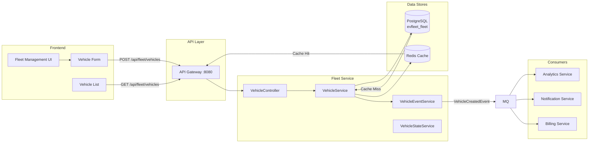

### Charging Session Data Flow

```mermaid
flowchart TB
    subgraph "Vehicle/Driver"
        VEHICLE[🚗 Electric Vehicle]
        DRIVER[👤 Driver App]
    end
    
    subgraph "Charging Infrastructure"
        STATION[âš¡ Charging Station]
        CONNECTOR[🔌 Connector]
    end
    
    subgraph "Backend Processing"
        GW[API Gateway]
        CHARGE_SVC[Charging Service]
        SESSION[Session Manager]
        RATE[Rate Calculator]
    end
    
    subgraph "Events & Notifications"
        
        NOTIFY[Notification Service]
        ANALYTICS[Analytics Service]
    end
    
    subgraph "Data Storage"
        DB[(PostgreSQL)]
        CACHE[(Redis)]
    end

    DRIVER -->|1. Request Charging| GW
    GW -->|2. Find Station| CHARGE_SVC
    CHARGE_SVC -->|3. Check Availability| DB
    CHARGE_SVC -->|4. Reserve Connector| CACHE
    
    VEHICLE -->|5. Plug In| STATION
    STATION -->|6. Start Session| CHARGE_SVC
    SESSION -->|7. Create Session Record| DB
    SESSION -->|8. ChargingStartedEvent| MQ
    
    MQ --> NOTIFY
    NOTIFY -->|9. SMS/Push to Driver| DRIVER
    
    STATION -->|10. Energy Delivery| VEHICLE
    SESSION -->|11. Update Progress| CACHE
    
    VEHICLE -->|12. Full Charge| STATION
    STATION -->|13. End Session| CHARGE_SVC
    SESSION -->|14. Calculate Cost| RATE
    RATE --> DB
    SESSION -->|15. ChargingCompletedEvent| MQ
    
    MQ --> ANALYTICS
    MQ --> NOTIFY
```

---

## Event-Driven Communication

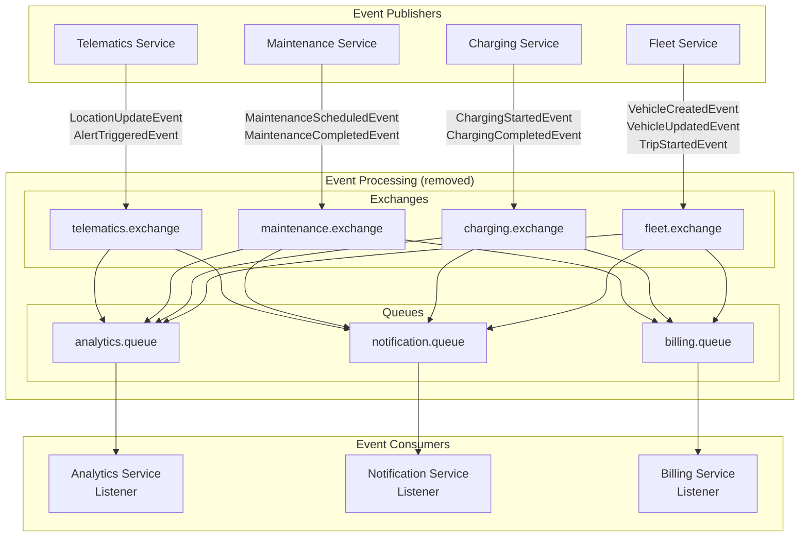

### Event Types

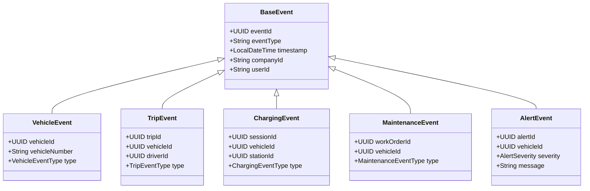

---

## Database Architecture

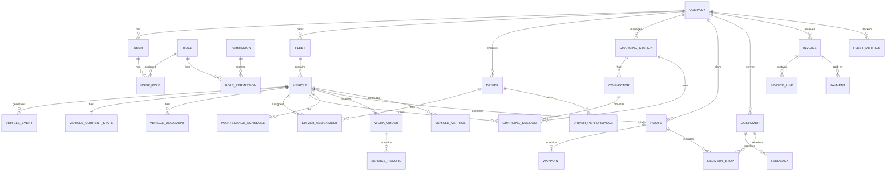

### Database Separation by Service

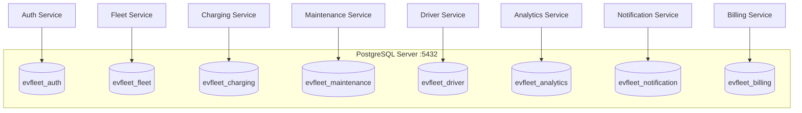

---

## API Request Flow

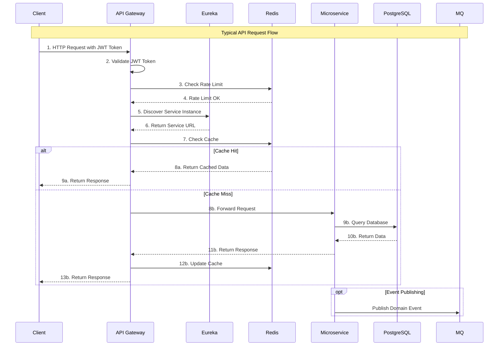

### API Endpoint Structure

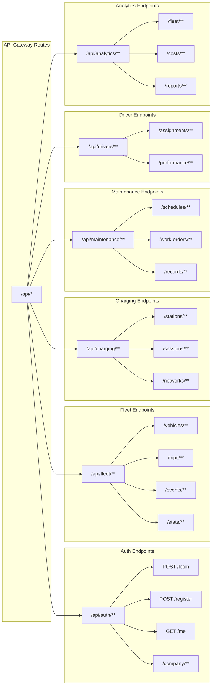

---

## Component Interaction Maps

### Dashboard Data Flow

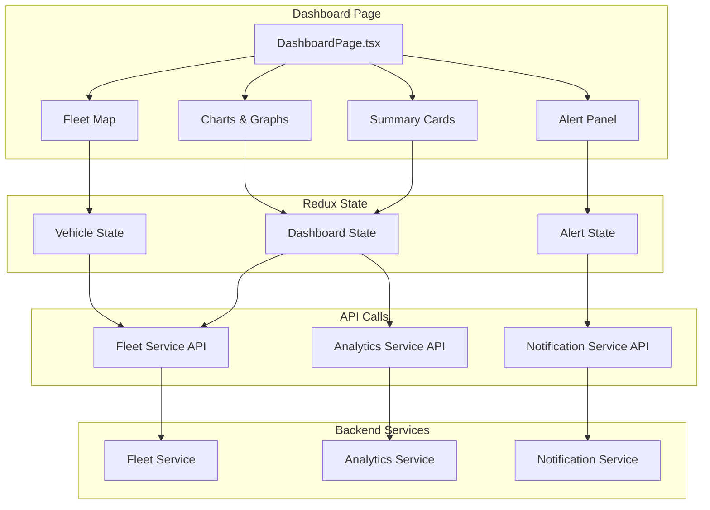

### Vehicle Lifecycle

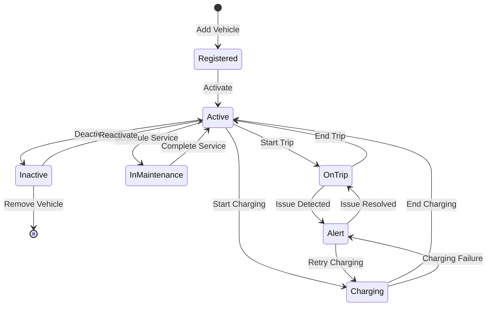

### Trip Management Flow

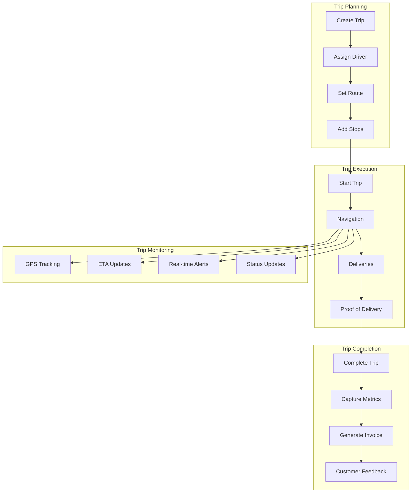

---

## Infrastructure Deployment Flow

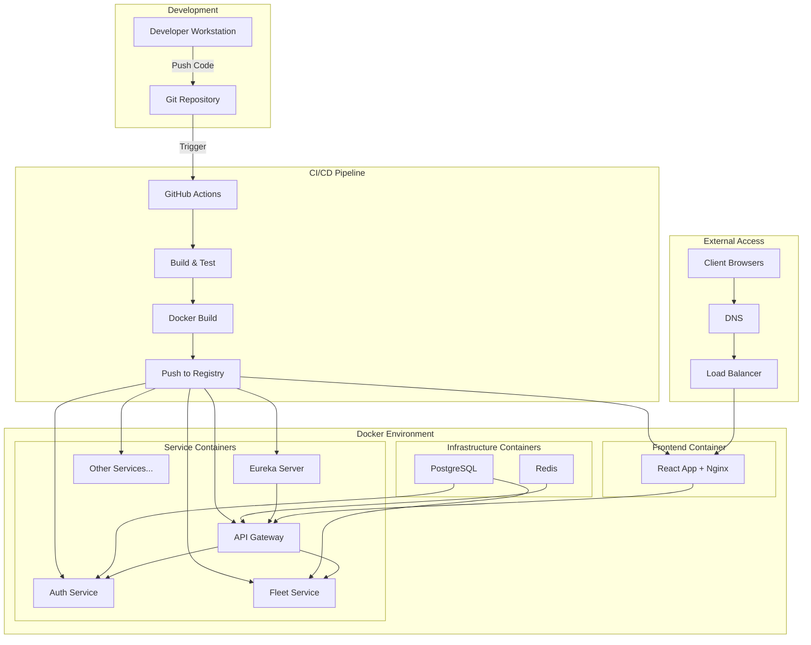

---

## Security Architecture

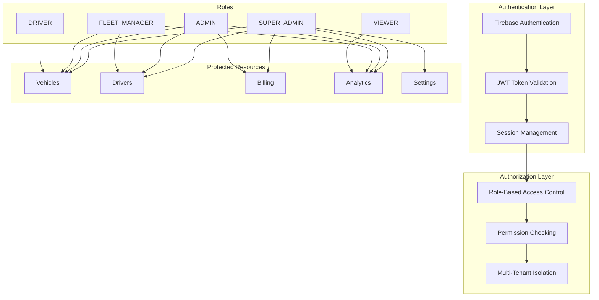

---

## Summary

This document provides a comprehensive flow chart of the Commercial EV Fleet Management Platform, covering:

1. **High-Level Architecture**: Overall system topology showing frontend, API layer, business services, and data stores
2. **Authentication Flow**: Firebase-based authentication with backend user synchronization
3. **Frontend Structure**: React application with Redux state management and protected routing
4. **Backend Architecture**: Monolith structure with modular domain-driven design
5. **Data Flow**: How data moves through the system for various operations
6. **Event-Driven Communication**: Spring Modulith ApplicationEvents for in-process communication
7. **Database Architecture**: Multi-database setup with service isolation
8. **API Structure**: RESTful API endpoint organization
9. **Component Interactions**: Detailed flows for dashboard, vehicle lifecycle, and trips
10. **Infrastructure**: Docker-based deployment with CI/CD pipeline
11. **Security**: RBAC-based authorization with Firebase authentication

---

## Port Reference

| Service | Port | Description |
|---------|------|-------------|
| React Frontend | 3000 | Web Application |
| API Gateway | 8080 | Single Entry Point |
| Auth Service | 8081 | Authentication & Authorization |
| Fleet Service | 8082 | Vehicle & Fleet Management |
| Charging Service | 8083 | Charging Infrastructure |
| Maintenance Service | 8084 | Predictive Maintenance |
| Driver Service | 8085 | Driver Management |
| Analytics Service | 8086 | Business Intelligence |
| Notification Service | 8087 | Alerts & Notifications |
| Billing Service | 8088 | Cost Tracking & Invoicing |
| Eureka Server | 8761 | Service Discovery |
| PostgreSQL | 5432 | Database |
| Redis | 6379 | Cache |

---

*Document Generated: December 2025*
*Platform Version: 2.1.0*
